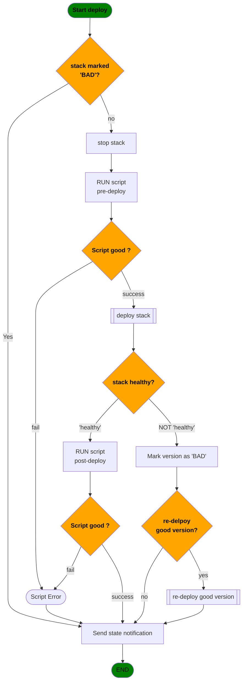
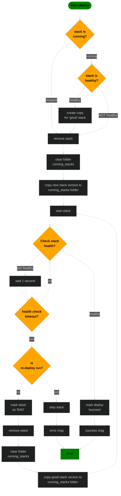

<!-- omit from toc -->
# Docker stack auto deploy

Docker stack auto start script
Script that auto starts docker stack from a git repo subfolder and also updates the stack on changes

## Table of Contents <!-- omit from toc -->

- [What it does](#what-it-does)
- [Rules and Limitations](#rules-and-limitations)
- [Deployment settings](#deployment-settings)
  - [Deployment settings location](#deployment-settings-location)
  - [Deployment method](#deployment-method)
    - [blind](#blind)
    - [simple (DEFAULT)](#simple-default)
    - [canary](#canary)
- [Deployment steps](#deployment-steps)
  - [general information](#general-information)
    - [used directorys](#used-directorys)
    - [stack versions marked bad](#stack-versions-marked-bad)
  - [script workflow](#script-workflow)
    - [Deployment Diagram](#deployment-diagram)
    - [Deployment method workflow](#deployment-method-workflow)
    - [blind](#blind-1)
    - [simple (DEFAULT)](#simple-default-1)
    - [canary](#canary-1)
- [dev notes](#dev-notes)

## What it does

this script will:

- clone a git repo
- scan specified folders for compose stacks
- deploy them (on changes redeploy)

in the future:

- run custom scripts for things like backups

## Rules and Limitations

1:
each stack MUST be in it's own folder
and there must be a docker `compose.yaml`(or .yml) file present

2:
Every stack should be setup to tolerate a full removel and redeploy
without data loss.
i.e. don't use docker volumes for persistend data as those will be removed as well

3:
no persistent data can be stored in the same directory as the `compose.yaml` file

4:
each service should have a `healthcheck` configured, <br>
or atleast the primary service. (used to determine stack health). <br>
services are considered "healthy" by default

## Deployment settings

### Deployment settings location

Deployment settings and be stored in `YAML` format in the following locations,<br> (in descending priority):

1:
In a seperate `deploy.yaml` (or `deploy.yml`) file

2:
in a comment block in the `compose.yaml` file,<br>
staring with `# Deploy Start #` and ending with `# Deploy End #`<br>
Example: <br>

``` yaml
# Deploy Start #
#
# deploy: true
# methode: "blind"
# test:
#     option1: value
#
# Deploy End #
```

### Deployment method

for all methodes the script will first

- run `docker compose down`
- remove the old files completly
- then copy the new files to the working directory

#### blind

The script blindly runs `docker compose up -d` and will do no further checks to ensure the stack is actually working

#### simple (DEFAULT)

The new stack version will be deployed,
if the stack doesn't appear "healthy" the new version will be taken down and the last known good version will be redeployed

a stack is considered "healthy" if:

- each services health check is good
- maybe more in the future #TODO

#### canary

! EXPERIMENTAL !

The idea is that the new stack version is deploy in parallel to the old version,
in order to reduce down time.

One idea was to use the `-p {name}` flag when running `docker compose up` to set a different "project name",
which is prepented to all stack service names. [Docker docs](https://docs.docker.com/reference/cli/docker/compose/#use--p-to-specify-a-project-name)

however this may cause problems depending on the stack setup.
For example accesing the same data dir, labels used by other services (reverse proxy), etc..

THe second idea is to deploy to a seperate testing/staging docker environment,
but that brings a whole bunch of new chalenges.

## Deployment steps

### general information

#### used directorys

stack files exist in 3 directorys.

1. Repo clone target
2. good_stacks (stacks here are verified working and saved in case of a roleback before deployment)
3. running_stacks (new files are copied here and used for active deployment)

#### stack versions marked bad

a stack version that is not `healthy` will be marked as `bad` and never redeployed

IMPORTANT
this feature should be able to bedeactivated via config variable

TODO figure this out
TODO is this even needed?
if stack files change the commit hash will also change
commit hash can change but stack files stay the same when any changes are commited to repo


ideas:

1. a json/yaml file in the root directory of the script<br>
conntent:
   1. stack_name
   2. commit hash
   3. date when marked as bad


maybe keep copy of bad stack files in a seperate folder?
before deploy check if a folder with the stack name exist,
if so compare the files (or the calculated linux file hashes) for differences

maybe only save the calculated files hashes?
use entire folder hash?
or induvidial files? but which files to check?
user could have it setup in a way where files are created in the stack folder after stack start (despite [rule #3](#rules-and-limitations))


---

### script workflow

1. Check all config values are set
2. clone repo
3. scan for updated stacks (that are in a watched folder)
4. deploy changed stacks
   1. check if stack is marked bad (TODO is this even needed?)
   2. attempt to load the deployment settings from one of the valid locations (see [here](#deployment-settings-location)), overwriting default values
   3. stop stack in docker (not remove)
   4. run `pre-deployment-script`
   5. if the stack was `healthy` the whole stack folder is copied from `running_stacks` to `good_stacks`
   6. remove stack in docker
   7. the stack folder in `running_stacks` is completly cleared
   8. the new stack files are copied from the repo folder to `running_stacks` folder
   9. the file `version.txt` is created with the conntent being the commit hash
   10. deploy stack to docker using deployment settings<br>
   when stack is not `healthy`:
      1. stack version is marked as `bad` (see [here](#stack-versions-marked-bad))
      2. remove stack from docker
      3. clear stack folder in `running_stacks`
      4. copy stack folder from `good_stacks` to `running_stacks`
      5. redeploy good stack<br>
       if stack is not `healthy`:
         1. stop stack in docker (not remove)
      6. log an error (maybe send notification)
   11. run `post-deployment-script`

---

#### Deployment Diagram

[Live editor](https://mermaid.live/edit)



#### Deployment method workflow

#### blind

The script blindly runs `docker compose up -d` and will do no further checks to ensure the stack is actually working

#### simple (DEFAULT)




#### canary

asd

## dev notes


Keep a list of stack health history for debuging
list should contain:

- stack name
- commit hash
- stack health state
- datetime
